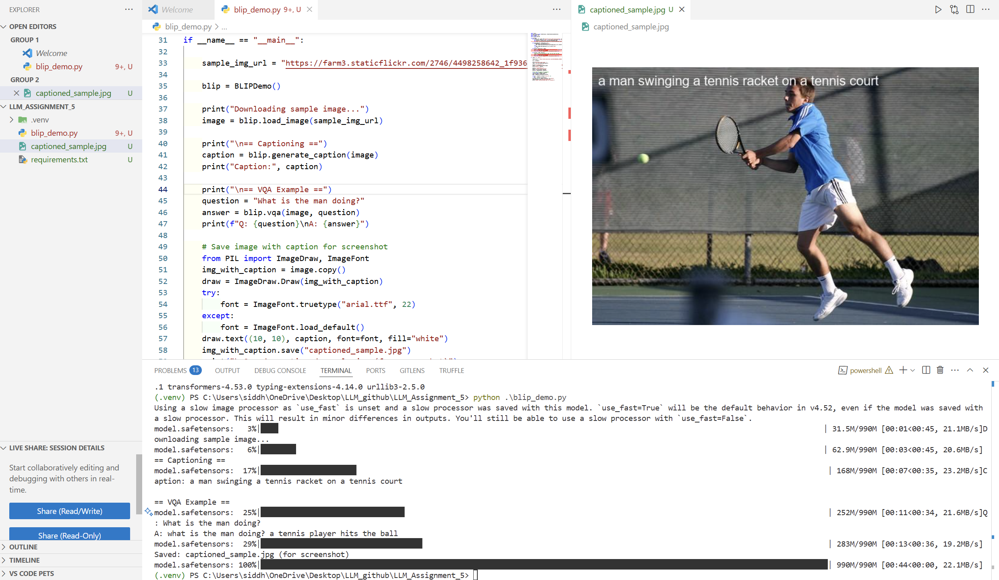

# Assignment 5.2: Multimodal Application Demo

This demo is a simple Python application using the [BLIP (Bootstrapped Language Image Pretraining)](https://huggingface.co/Salesforce/blip-image-captioning-base) multimodal model for image captioning and visual question answering (VQA). The app takes an image as input and generates a relevant caption or answers a question about the image.

## Screenshot of working



---

## How the Model Works

**BLIP** is a transformer-based model that connects images and language:

- **Image Encoder:** A Vision Transformer (ViT) processes the input image to extract visual features.
- **Text Decoder:** A transformer generates natural language (captions or answers).
- **Multimodal Fusion:** BLIP can jointly consider both the image and any provided text (like a question).

For **image captioning**, BLIP takes only the image and outputs a descriptive caption.  
For **visual question answering (VQA)**, it takes both an image and a question as input and generates a relevant answer.

---

## Sample Input and Output

**Input Image:**  


**Generated Caption:**  
a man swinging a tennis racket on a tennis court

**Visual Question Answering:**

- **Question:** What is the man doing?
- **Answer:** what is the man doing? a tennis player hits the ball

**Output Image (with caption):**  


---

## How to Run

1. Install the requirements:
   ```
   pip install -r requirements.txt
   ```
2. Run the demo:
   ```
   python blip_demo.py
   ```

Replace `input.jpg` with your own image to try other examples!

---

## References

- [BLIP model on Hugging Face](https://huggingface.co/Salesforce/blip-image-captioning-base)
- [BLIP: Bootstrapped Language Image Pretraining (arXiv)](https://arxiv.org/abs/2201.12086)
